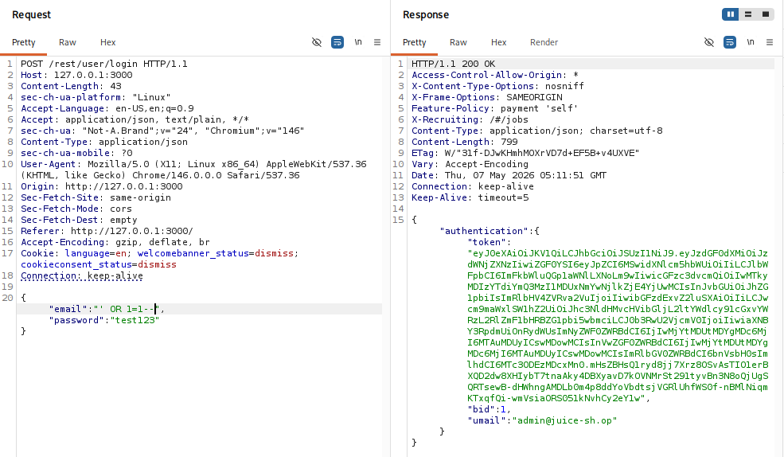
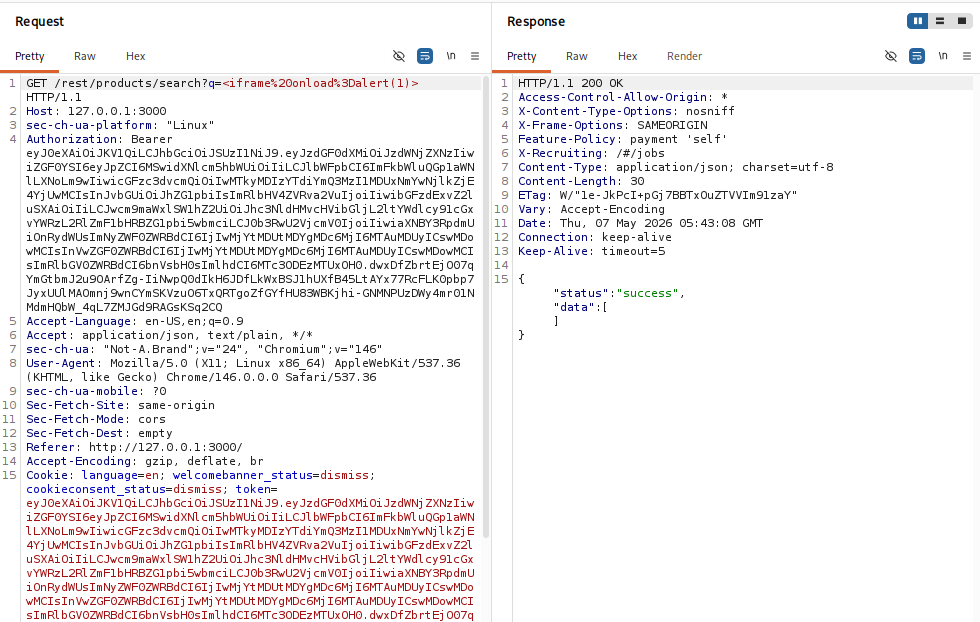
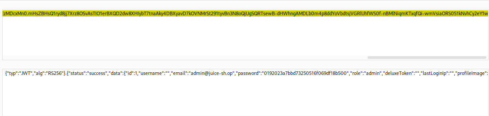
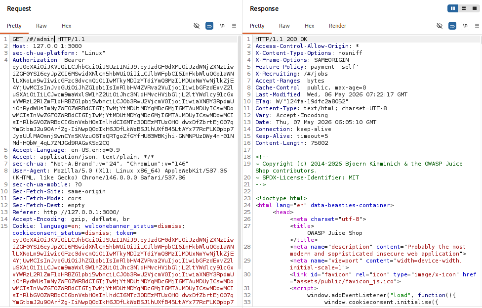
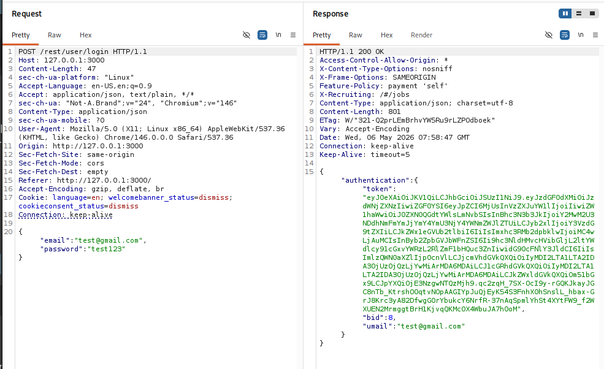

# 🍊 OWASP Juice Shop Penetration Testing Lab

## 🎯 Objective

Perform web application penetration testing against OWASP Juice Shop to identify and exploit common web vulnerabilities using Burp Suite.

---

# 🧱 Lab Environment

| Component | Details |
|---|---|
| Target Application | OWASP Juice Shop |
| Operating System | Kali Linux |
| Testing Tools | Burp Suite Professional |
| Browser | Burp Embedded Browser |
| Platform | Docker |

---

# 🛠️ Tools Used

- OWASP Juice Shop
- Burp Suite
- Kali Linux
- Docker
- Firefox / Burp Browser

---

# 🔍 Testing Methodology

The assessment followed a structured web application penetration testing workflow:

1. Application Enumeration
2. HTTP Request Interception
3. Authentication Testing
4. SQL Injection Testing
5. Cross-Site Scripting (XSS) Testing
6. JWT Token Analysis
7. Access Control Testing
8. Vulnerability Documentation

---

# 🚨 Findings Summary

| Vulnerability | Severity |
|---|---|
| SQL Injection Authentication Bypass | Critical |
| Reflected Cross-Site Scripting (XSS) | High |
| Sensitive Data Exposure (JWT Disclosure) | Medium |
| Broken Access Control / Admin Access | High |

---

# 1️⃣ SQL Injection Authentication Bypass

## Description

A SQL Injection vulnerability was identified in the login functionality. The application improperly sanitized user-supplied input, allowing authentication bypass.

## Payload Used

```sql

' OR 1=1--

```

## Impact

- Authentication bypass
- Unauthorized admin access
- JWT token acquisition

## Evidence

### Successful SQL Injection Payload



---

# 2️⃣ Reflected Cross-Site Scripting (XSS)

## Description

The search functionality reflected unsanitized user input into the browser, allowing JavaScript execution.

## Payload Used

```html
<iframe onload=alert(1)>
```

## Impact

- Arbitrary JavaScript execution
- Potential session theft
- Browser-side attacks

## Evidence

### Successful XSS Execution



---

# 3️⃣ Sensitive Data Exposure (JWT Analysis)

## Description

JWT tokens exposed sensitive information including:
- Admin email
- Role information
- Internal user metadata

## Impact

Attackers may enumerate privileged accounts and analyze authorization structures.

## Evidence

### Decoded JWT Token



---

# 4️⃣ Broken Access Control

## Description

Administrative functionality was accessible using the compromised JWT token obtained through SQL Injection.

## Impact

- Unauthorized administrative access
- Privilege escalation
- Access to restricted functionality

## Evidence

### Admin Access Request



---

# 📸 Additional Screenshots

## Original Login Request



---

# 🧠 Skills Demonstrated

- Web Application Penetration Testing
- Burp Suite Usage
- HTTP Request Analysis
- SQL Injection Testing
- Cross-Site Scripting (XSS)
- JWT Token Analysis
- Access Control Testing
- Vulnerability Documentation

---

# 🛡️ Remediation Recommendations

- Use parameterized SQL queries
- Implement secure input validation
- Apply output encoding and sanitization
- Minimize sensitive JWT contents
- Enforce strict access control validation
- Implement Content Security Policy (CSP)

---

# ⚠️ Disclaimer

This project was conducted in a self-hosted lab environment for educational and ethical security testing purposes only.
